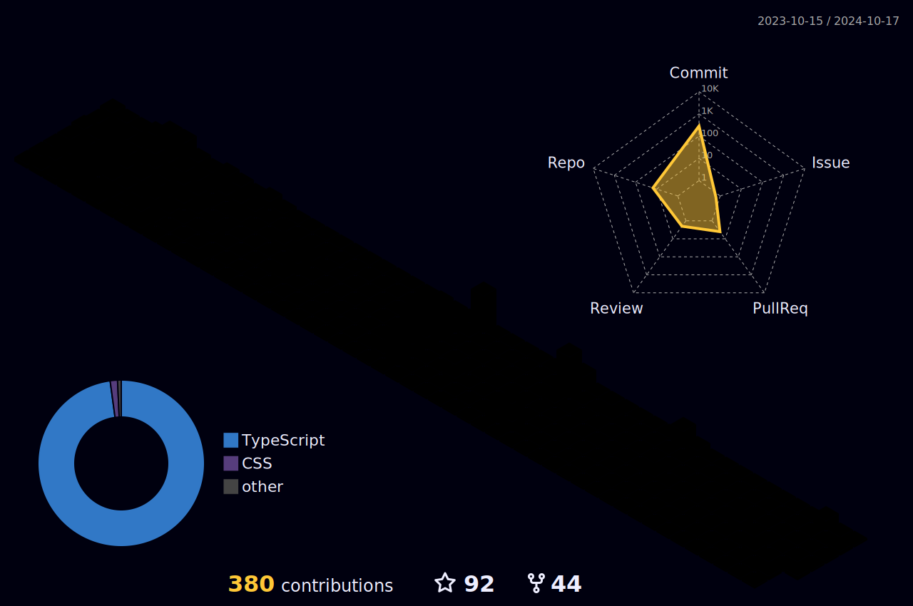

# Hello 👋 my name is Igor Bitencourt! 
## I am a full-stack developer 👨‍💻
### Welcome to my GitHub profile 👋

  
  

  
 |  |  |  
 | ----------- | ----------- |

 
  

   

  

 
##
   

     
  

